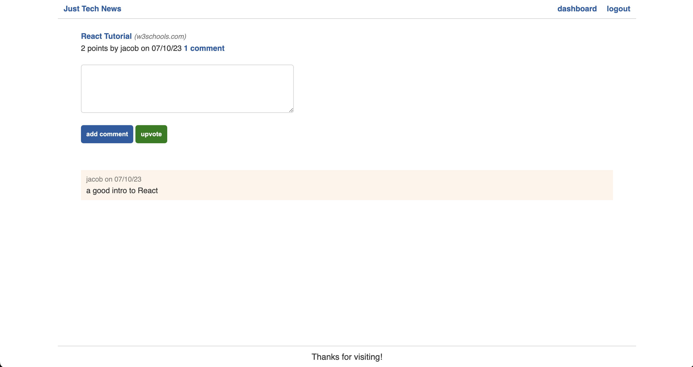

# Just Tech News

Welcome to Just Tech News! This website allows users to stay up-to-date with the latest technology news by posting links to tech articles and engaging in discussions through comments.

## Table of Contents

- [Features](#features)
- [Installation](#installation)
- [Usage](#usage)
- [Contributing](#contributing)
- [License](#license)

## Features

- User Registration: Users can sign up and create an account to access all the features of Just Tech News.
- Post Articles: Users can submit links to tech news articles, allowing others to discover and discuss the latest news in the tech industry.
- Commenting System: Users can comment on posts, engage in conversations, and share their thoughts on the news articles.
- User Profiles: Each user has a dashboard where their posts are displayed, providing a snapshot of their activity on the platform.
- Responsive Design: The front-end code provided by edX Boot Camps LLC ensures that the website is optimized for various devices and screen sizes.

## Usage

Visit the site: [https://just-tech-news-daily-594de3f5fe7b.herokuapp.com/](https://just-tech-news-daily-594de3f5fe7b.herokuapp.com/)

- Click "login" to login or sign up
- Click links on the homepage to view news articles
- Click "comments" below a link to read and post comments about the article and to upvote the post
- Visit your dashboard to view your posts or to create a new one

## Contributing

Contributions to Just Tech News are welcome! If you want to contribute to the project, please follow these steps:

1. Fork the repository on GitHub.
2. Create a new branch with a descriptive name for your feature or bug fix.
3. Implement your changes, following the project's coding style and guidelines.
4. Write appropriate tests for your changes to maintain code quality.
5. Ensure that all tests pass successfully.
6. Submit a pull request, providing a clear and concise description of your changes.

## License

Just Tech News is released under the [MIT License](LICENSE). Please review the license file for more details.

---

Front End Code provided by edX Boot Camps LLC
Back End Code developed under the guidance of the "Python for JavaScript Developers" course from edX Boot Camps LLC
